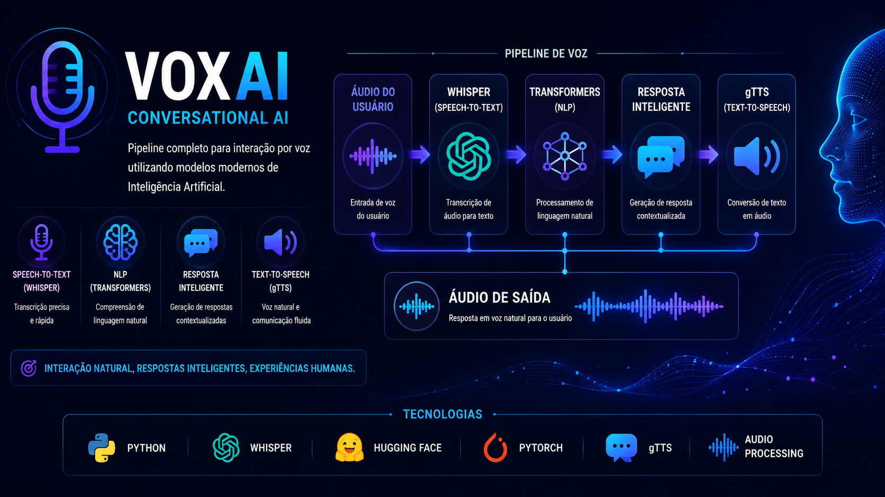

<p align="center">
  
</p>

# 🎙️ VoxAI

> **Conversational AI • Speech-to-Text • Natural Language Processing • Text-to-Speech**

Pipeline completo para interação por voz utilizando Inteligência Artificial, integrando reconhecimento de fala, processamento de linguagem natural e síntese de voz para proporcionar experiências conversacionais inteligentes.

---

# 📌 Sobre o Projeto

O **VoxAI** foi desenvolvido para demonstrar a construção de um pipeline moderno de Inteligência Artificial Conversacional.

O projeto integra diferentes modelos especializados para transformar voz em texto, interpretar a intenção do usuário, gerar respostas inteligentes e converter novamente a resposta em áudio.

Além da aplicação prática em assistentes virtuais, o projeto demonstra conhecimentos em processamento de linguagem natural (NLP), IA Generativa e integração entre modelos de IA.

---

# 🧠 Pipeline de IA

```text
Áudio do usuário
        │
        ▼
 Speech-to-Text (Whisper)
        │
        ▼
 Processamento de Linguagem Natural
 (Transformers)
        │
        ▼
 Geração da Resposta
        │
        ▼
 Text-to-Speech (gTTS)
        │
        ▼
 Áudio de saída
```

---

# 🚀 Principais Funcionalidades

- 🎤 Conversão de voz em texto (Speech-to-Text)
- 🧠 Processamento de Linguagem Natural (NLP)
- 💬 Geração de respostas inteligentes
- 🔊 Conversão de texto em voz (Text-to-Speech)
- ⚡ Pipeline modular para aplicações conversacionais

---

# 🛠️ Tecnologias Utilizadas

| Categoria | Tecnologias |
|-----------|-------------|
| Linguagem | Python |
| Speech-to-Text | Whisper |
| NLP | Transformers |
| IA | Hugging Face |
| Deep Learning | PyTorch |
| Text-to-Speech | gTTS |

---

# 💡 Diferenciais

✔ Pipeline completo de IA Conversacional

✔ Arquitetura modular e escalável

✔ Integração entre múltiplos modelos de IA

✔ Aplicação prática de NLP

✔ Comunicação por voz em linguagem natural

---

# 🔄 Evolução do Ecossistema

Este projeto representa a evolução da interação entre usuários e Inteligência Artificial dentro do meu portfólio.

```text
MiniGuia SFN Investimentos
            │
            ▼
      Base de Conhecimento
            │
            ▼
         VoxAI
            │
            ▼
 Interação por Voz
            │
            ▼
   BIA Academy Finance
```

---

# 👩‍💻 Autora

**Barbara Freitas**

📊 Data Analytics • Machine Learning • Generative AI • Financial Intelligence

[](https://www.linkedin.com/in/barbarafreitas-dataanalytics)

[](https://github.com/BARBARANFS)
